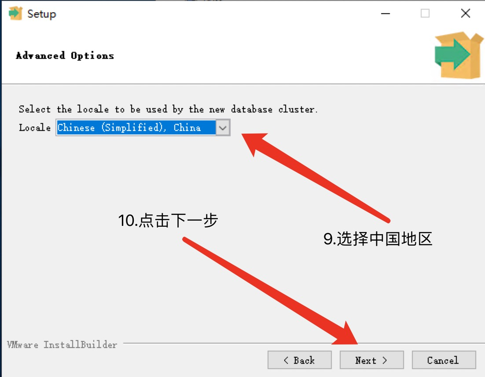

# homeassistant 虚拟数据获取教程

* [1.前期准备](#index1)


<span id="index1"></span>

## 前期准备
```angular2
数据库服务 postgresql-11.9-1-windows-x64.exe
数据库软件 navicat150_pgsql_en_x64.exe
智能家居数据源 home_assistant_data.csv
```
* windows环境下安装数据库





数据库服务安装完成
* PostgreSQL工具安装


* 运行这个软件


* sql 语句
```angular2
CREATE TABLE iot_sensor_data (
    id SERIAL PRIMARY KEY,
    传感器串号 character varying(32),
    时间是否重复 boolean,
    间隔时间 integer,
    间隔类型 character varying(16),
    间隔单位 character varying(16),
    重复就省略 boolean,
    单位 character varying(32),
    变量类型 character varying(64),
    制造商 character varying(64),
    模块 character varying(64),
    房间编号 character varying(16),
    房间类型 character varying(16),
    楼层 integer,
    面积 numeric(15,7),
    体积 numeric(15,7),
    家庭编号 character varying(32),
    时间 timestamp without time zone,
    数据 smallint
);

-- Indices -------------------------------------------------------

CREATE INDEX iot_sensor_data_传感器串号_idx ON iot_sensor_data(传感器串号 text_ops);
CREATE INDEX iot_sensor_data_单位_idx ON iot_sensor_data(单位 text_ops);
CREATE INDEX iot_sensor_data_模块_idx ON iot_sensor_data(模块 text_ops);
CREATE INDEX iot_sensor_data_房间编号_idx ON iot_sensor_data(房间编号 text_ops);
CREATE INDEX iot_sensor_data_房间类型_idx ON iot_sensor_data(房间类型 text_ops);
CREATE INDEX iot_sensor_data_家庭编号_idx ON iot_sensor_data(家庭编号 text_ops);
CREATE INDEX iot_sensor_data_时间_idx ON iot_sensor_data(时间 timestamp_ops);
CREATE INDEX iot_sensor_data_数据_idx ON iot_sensor_data(数据 int2_ops);
```


* 导入数据
